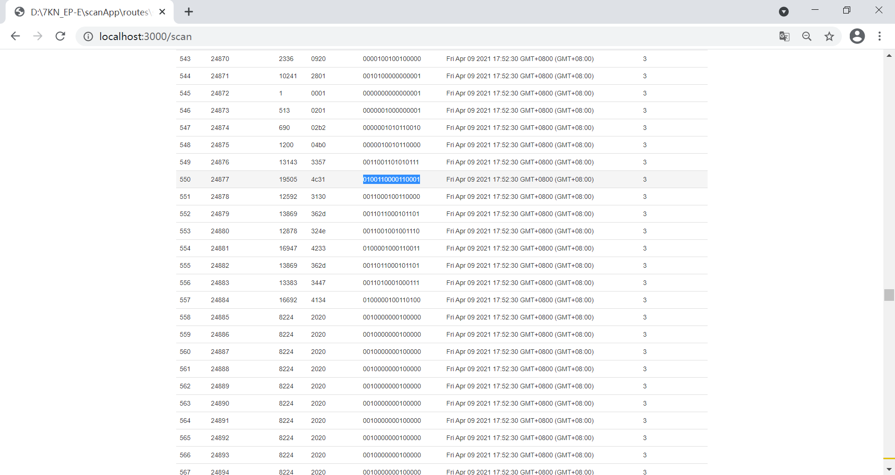

# 快速搭建MODBUS 采数和展示网站 #
最近调试一个Air Cercuit Breaker 设备，遇到了若干跟电力保护功能相关的变量采样值无法对号入座的问题。于是就想手写一段代码验证manual 上的描述是否确切 - 例如焦耳积分量和控制室温度的测量都直接关系到寿命预测算法是否能对齐，对于刀闸的L\S\I\G\N 类型跳闸的事件也必须区分清楚，出了事故麻烦恐怕就大了。所以花了一下午撸了一个Node.js + Express 框架 + EJS 前端脚本模板的局域网网站搭建运行的网站，专门用于MODBUS TCP 协议数据采集和展示。

## 数据采集和展示 ##
众所周知Node.js 模块库种类丰富并且社区很健康，类似MODBUS 协议就有不少于3种实现。根据颜值我选择了"jsmodbus v4.0.0"  作为通信连接驱动； 从尽量轻量和无编码角度出发，我只需要简单封装成Promise 以闭包形式实现语言的异步执行环境到访问资源的同步执行；日志采用 "log4js v6.3.0" 默认配置成开发者模式将日志保存到硬盘的public 目录（专家评价一下这是不是一个好主意）。前端利用ejs 模板来动态解析访问到的数据点位。

### 采集 ###
只是用Promise 同步化一下jsmodbus模块。我能想到的另外一个处理办法也许是基于emitter 的版本，有空我可以写一个那样的。对于通常的访问远端设备，公开的通信协议和专有的物理地址空间是两个正交量。于是每一种设备都不同。MODBUS 协议在能源和电力领域也用了好久，优势在于比较稳定而且感谢原创者的慷慨没有授权费用。同样意味它过于古董而不受IoT 业界的看好。最大的制约是对事件和pub/sub 机制的支持问题。

通信的本质是get 到对端的 response，对于TCP/IP 类型的连接，用IP 地址和端口打开对端的socket 就可以读写访问，用完以后记得关闭。于是建模时我把一台设备的访问参量抽象成：
- 公共参量例如对端设备类型识别码和采样周期
- 协议连接参量例如IP地址、端口和用户名、密码
- 专有地址空间例如寄存器起始地址和数目

这些参量确定了对端设备的模型最小可用集。把系统最小化会方便调试和找出问题的本质。

再回到一个实用系统对Event 的支持话题上来，这是任何一个成熟软件绕不过的考核。MODBUS 协议本身是基于poll 的，70年代那时人们开辟的类似串口的轮询已经非常工业了（同时代的其它行业的可参考GPIB/IEEE488.2 美陆的协议），没有必要再快了。后来出现了工业以太网等概念就把这些概念给挑战了。 虽然基于MQTT 或者Redis 都能快速实现一个pub/sub 体系，但是MODBUS 还是需要理解一下这当中的距离。我们这里说的事件响应就仅仅是近实时的，例如过载脱扣这样的事故需要软件系统发出实时告警，轮询就差了，甚至有可能还会漏掉告警。怎么办？ 这里的事件告警类似电站系统的遥信概念，就是数字量感知，怎么做呢？ 就是不停轮询设备状态字的特定Status bit位，发现它变化了就触发事件（接下来可以通过邮件或者MQTTs 等传递到上层stakeholder ）；如果是关键事件或者有害事件则发出告警或者控制其他机构动作，总体而言是遥控（有时对象是机器有时是人），这就是类似的MODBUS 或者RS485 总线上实现时髦的pub/sub 机制的本质。客户肯定会问这种做法可靠吗？ 答案也是用数据来说，一个状态位更新如果是亚毫秒量级，这就 满足大部分需求了；如果事件响应需要几分钟或者几十秒钟则会受到选型时的拷问和质疑。在普通局域网中访问寄存器的速度到底有多快？我在代码中简单Profiling 了轮询一次920 寄存器的时间统计，很鼓舞的结果190~220ms。 即使全部更新一次Breaker 的1840 byte 的状态字（其实远没有这么多，这跟程序优化寄存器地址的访问有莫大的关系-系统地址空间往往是连续的，我们可以一次性访问协议或者机器规定的上限例如125： 显然TCP 时代的报文远大于这个数量，但是要了解到当初在串行总线网络里的ADU 被限制在256byte 于是造成协议数据单元PDU 最大只能取253字节，这个极值被保留下来造成RS232/485 以及TCP 网络里PDU还是这个特定值，这就是study历史的意义，而并不是协议里限制了物理帧的传输长度，具体可查阅4.1 Protocol description）也耗时不到1 second，非常值得尝试。这也是下文谈论实现细节时提到实现采样值的二进制字符串显示的话题。


再进一步，在软件便利性上我们还能做什么呢？ 对了，类似OPC UA 和IEC 61850 那样的模型discovery 功能。 就是在采样Measurement 之前通过接口去查询设备变量结构树，借鉴IEEE488.2 技术标准，就是实现对设备的*IDN? 的访问接口。这样做有什么好处呢？ 可以帮厂商多卖设备，因为编程接口开发变得准确了。 不同firmware 里变量的寄存器地址可能增加和升级，但是只要有层级树能访问到它们的地址集，并用可读的方式（例如定义一个description 字段帮助理解寄存器含义）返回查询结果，能大大地增强开发效率。可惜的是目前只有精密测量设备具备这样的接口，工业和电力设备除了61850 电站用电力设备外其它没有这样的现成接口，需要工程师自己来开发。这样一来不仅能提高测量参量开发，也能增强设备的事件上报能力。 顺便提一句488.2 协议真是一种自动化测量非常靠谱的参考标准。 经过了30 来年的现场验证，绝对值得一读。

### 展示 ###
展示数据的功能必须是异步的。也就是HTTP 请求不应该去依赖我的测量和采样动作，因为那样多用户局域网并发访问就会发生数据更新的不一致-我们要尽量降低HTTP 请求里的操作时延。 和前面南向数采函数同步化（因为网络资源是唯一的互斥的不存在并行的条件）不同，多用户通过网页查询后台数据需要异步。try the best 这才是互联网的本质。没有强制也没有保证，当前有什么样的数据就展示什么样的结果，每个用户都可以在内存中得到一个样本拷贝，可能是一样的，也可能完全不一样。
寄存器读出来的数据在Node.js 里是用Buffer 这种字节流来表示的（读者可以思考一下为什么不用字符串？）刚开始我显示的只是类似65535 这样的数值，可是很快发现HEX 格式似乎更容易理解； 做完后又得到需求Binary 似乎才是状态字类型的最好格式。于是同一个寄存器值的present 扩展到3 种格式-对了，还有一种是字节流的ASCII 码显示，因为某些寄存器会存储设备序列号和铭牌信息或者时间戳字符串。这样的展示极其容易在一大堆怪字符里发现你想要的关键信息。 对了，大数据不仅仅是数据多和杂，关键还在于数据的理解，这里提到的16进制 2 进制展示，以及ASCII 字符串展示在实际工作中往往一下子就能回答我们抓取的数据值是不是对的，解决我对程序正确性的无端担忧。数据展示和理解绝对是大数据推广的前置条件。


## 测试，调试，Profiling， 优化性能 ##
第一步是看程序跑起来会不会崩溃。这不是一个无聊的假设，因为我就尝试了3次，第一次是一个循环变量改过以后循环体里忘记改了；第二次是配置文件的IP 地址配错了； 第三次是ejs 模板缺少了header 和 footer 造成网页无法展示虽然trace 显示的访问南向设备是OK 的。

如果有断路器实物我们可以直接用网线连接进行数据点位采集； 可是万一没有就只能基于历史记录或者其它类似的MODBUS 协议设备来调试程序。或者大家都认为基于历史记录很low，但是如果有一个恰当的记录文件，我们可以用在很多调试中- 例如response 的数据layout 和 采集到的Buffer 的长度。尤其是Buffer 的处理，有了一些基线数据例如时间戳共调试以后，这部分可以解决掉绝大部分的展示网页的调试。

Profiling 意味剖析瓶颈-如果没有瓶颈或者性能捉急的地方也就不用调优了，所以性能切片是调优的前期判断。这里我们只需要在采集数据的循环上利用日志打印出取到545 个寄存器的总体时间。

### 连接错误 ###
当我们用这段程序访问一台不存在的设备时会发生连接超时错误，底层送上来ERRORCONNECT 这是容易理解的，但是用户看到这段这个报错码会丈二金刚摸不着脑袋 - 跟他的配置有什么关系吗？ 所以在该类型错误对象上附加必要的地址信息会非常容易排查：

```
    ...
    socket.on('error', (error)=>{
        socket.end()
        error.ip = addressSpace.protocolData.ip
        error.port = Number(addressSpace.protocolData.port)
        tracer.error(error)
        reject("socket: " + error)
    })

```

就是这么简单地添加上两个参量就能拯救80% 的尴尬 出了错不知道错误原因在哪。有时是配置从别的机器拷贝过来未经验证；有的是端口改了；有的是设备关机了。

### MODBUS 设备访问故障 ###
写软件的最怕遇到硬件故障 - 但这却不可避免。上来我首先确认了硬件型号、firmware 版本、选件型号、选件版本、通信选项。 并且阅读手册自己建立了如下的物理地址Bank：
```
module.exports = {
    channel: "modbustcp",
    repeatIntervalMs: 6000,
    protocolData: {
        ip: "i.p.x.y",
        port: 502,
        subordinatorNumber: 127,
        timeoutMs: 6000,
        functionType: 3
    },

    physicalAddress: {
        start: 23309,
        count: 100,
        registerGrid: [
            // COUNT MUST LESS THAN 100 FOR SAFETY
            ...
            {start: 13569, count: 99},      //4.5.2 Data set DS 53: Trip log
            {start: 13670, count: 22},      //4.5.2 Data set DS 53: Trip log
            ...
        ],
    }
}

```
在physicalAddress 域定义了当前取数的寄存器起始地址和长度，在registerGrid 栏里是待访问区域，都是register。 这里的版本是后来修改过的，原始的版本我尝试一次读取一段121 个寄存器，但是设备/COM35通信模块 限制了读取数量所以程序就报了下面的错误：

```
  UserRequestError {
  err: 'ModbusException',
  message: 'A Modbus Exception Occurred - See Response Body',
  response:
   ModbusTCPResponse {
     _id: 1,
     _protocol: 0,
     _bodyLength: 3,
     _unitId: 127,
     _body: ExceptionResponseBody { _fc: 3, _code: 2 } } }

```
利用搜索引擎我们可以定位到错误码2 意味非法地址[ILLEGAL DATA ADDRESS](https://www.automationdirect.com/microsites/c-more/software-help/Content/503.htm), 没有办法，只能将大于100 个的寄存器拆分. 拆分的寄存器数目貌似最好是奇数，99个可以，而100个访问还是报错。于是就出现了上述的手动分段地址。通过这种微操解决了地址非法的故障。

### 前端数据格式美化 ###
一个软件的灵魂在它的界面。非常好的数据和设计也可能有一个非常反人类的界面，而简陋的数据和没有设计也可以营造一个人性化的界面。我的目的是取出寄存器数据按照地址进行排列，展示呈一个表格。同事要求看寄存器的Binary二进制布局，Hex 十六进制不能反映bit 位解码的实时结果。于是这里花了一点时间增加了整数转二进制字符串的功能。功能本身利用搜索引擎就能解决，但是在这样的格式存在一个问题就是padding。 同样的0x06 程序转换结果是110，而不是梦里期待的0000 0110 这样规整的格式。网络资源又发生了神奇的效果，我看到一篇非常好的[segmentfault 讨论文章](https://segmentfault.com/q/1010000002607221)，也有一个非常高效的方法来实现二进制字符串的高位填零。思路是先在二进制字符串的高位添加足够长的"0" 再进行substr() 截取！ 用我等潜水看客的话说就是受益匪浅。

```
        if(typeof(intValue) === 'number'){
            const result = intValue.toString(2)
            const s = ("0000000000000000" + result)
            const paddedStringInt = s.substr(-16, 16)//16 bit position
            return paddedStringInt
        }

```

对于如何呈现到网页界面，仁者见仁智者见智而我独爱表格。


网页能展现同一个寄存器多个视角，帮助调试云APP。

### 日志 ###
日志是开发人员的终极武器。没有太多需要注意的，简单用log4js 加个配置就能工作，日志可以输出到多种类型目标，控制台，文件，网络端口甚至邮件。自测项目里也可以用日志来保存中间结果，查看数据流，并加速调试。 

```
...
const log4js = require('log4js')
const tracer = log4js.getLogger('routes:modbus')

```

### 异常处理，开发测试 ###
是的，异常处理是一门艺术- 对于这个小项目来说，对于异常处理的理解和改造来自于前述的MODBUS 访问故障。当硬件故障时，我需要明确知道上下文的参量-这里就是出故障的寄存器地址，长度和功能码。 于是就很自然在代码里让error 结构体带上上述这么几个参量来定位故障

```
    ...
    catch(function (error) {
        error.start =  Number(addressSpace.physicalAddress.start)
        error.count = Number(addressSpace.physicalAddress.count)
        error.fc = addressSpace.protocolData.functionType
        socket.end();
        reject(error)
    })
```

开发测试可以依赖mocha 模块； 这是从另外一个项目里偷师过来的。在package.json 添加

```
  "devDependencies": {
    "mocha": "~7.2.0"
  }
```

并且设定 npm test 执行指令为

```
  "scripts": {
    "start": "node ./bin/www",
    "test": "mocha --max_old_space_size=9000 ./test/*.js"
  },
```

用通配符表示执行项目test 目录下所有后缀为 .js 文件的测试
```

let toBinaryString = require("../routes/scan").toBinaryString
describe('routes', function () {
  describe('scan', function () {
    describe('#datatype', function () {
      it('boundray', async function () {
        const buf4 = Buffer.from([5, 255])
        const bstr4 = toBinaryString(buf4)
        tracer.info(bstr4)

        const buf5 = Buffer.from([243, 155, 91])
        const bstr5 = toBinaryString(buf5)
        tracer.info(bstr5)

        const buf6 = Buffer.from([243, 0])
        const bstr6 = toBinaryString(buf6)
        tracer.info(bstr6)

        assert.ok(true, "pass unit test")
      })
    })
  })
})

```

完成测试代码后就在terminal 下指令npm test 实现测试。测试过程可以通过日志系统保存和观察。完成后你可以收到一串非常舒服的绿色

```

[2021-04-09T23:49:25.926] [INFO] test::routes::binstring - 0000010111111111
[2021-04-09T23:49:25.930] [INFO] test::routes::binstring - NaN
[2021-04-09T23:49:25.930] [INFO] test::routes::binstring - 1111001100000000
        √ boundray


  1 passing (32ms)

```
当然你可以安排更多和更全面的case 增强覆盖。